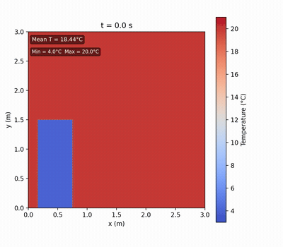
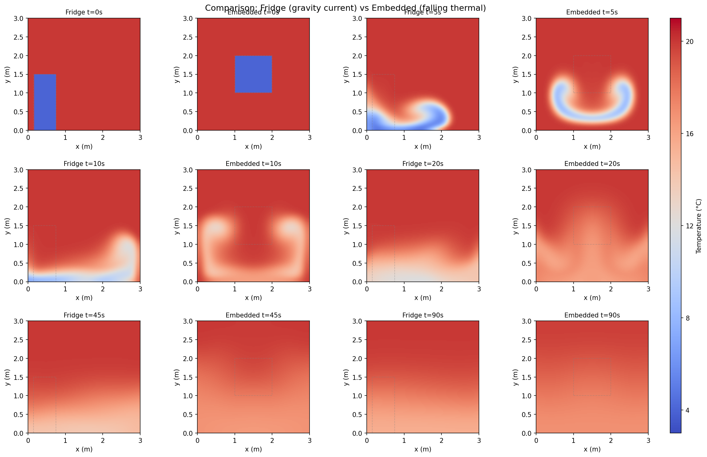

<p align="center">
  
  
  
  
  
</p>

# ❄️ ChillFlow

A 2D buoyancy-driven convection toy that simulates what happens when a pocket of
cold air is released into a warmer room. Watch it slump, spread, stratify, and
slowly homogenise — all driven by buoyancy, not conduction.

<p align="center">
  
  <br>
  <em>Fridge configuration: cold block on the floor slumps as a gravity current.</em>
</p>

---

## 📋 Table of Contents

- [The Physics in One Paragraph](#the-physics-in-one-paragraph)
- [Configurations](#configurations)
- [How It Works](#how-it-works)
- [Quick Start](#quick-start)
- [Results](#results)
- [Assumptions & Limitations](#assumptions--limitations)
- [File Reference](#file-reference)
- [Extending the Toy](#extending-the-toy)
- [References](#references)
- [License](#license)

---

## The Physics in One Paragraph

If you open a fridge, the cold air doesn't just sit there. It's denser than the
warm room air, so it **falls** and **flows** across the floor. Pure conduction
across a 3 m room would take **days** — but convection equalises a room in
**minutes**. This simulation models that flow. It solves the
vorticity–streamfunction form of the Navier–Stokes equations under the
Boussinesq approximation, with a spectral Poisson solver and semi-Lagrangian
advection. The result is a surprisingly rich evolution: release → slump/fall →
gravity current → stratification → homogenisation.

---

## Configurations

Two setups are provided. They share the same solver; only the initial cold
region differs.

| Configuration | Script | Cold region | Behaviour | Preview |
|---|---|---|---|---|
| **Fridge** | `Fridge.py` | 0.6 m × 1.5 m block on the floor, left wall | Sideways **gravity current** | [`fridge_simulation.mp4`](fridge_simulation.mp4) |
| **Embedded** | `Embedded.py` | 1 m × 1 m cube centred in the room | **Falling thermal** → mushroom → gravity current | [`embedded_simulation.mp4`](embedded_simulation.mp4) |

The only code difference between the two is the boolean mask that selects which
cells start cold.

---

## How It Works

### Governing equations

The flow is modelled with the **vorticity–streamfunction** formulation (2D,
incompressible, Boussinesq):

$$
\nabla^2\psi = -\omega,
\qquad
u = \frac{\partial\psi}{\partial y},
\qquad
v = -\frac{\partial\psi}{\partial x},
$$

$$
\frac{\partial\omega}{\partial t} + (\mathbf{u}\cdot\nabla)\omega
= \nu\,\nabla^2\omega + g\beta\,\frac{\partial T}{\partial x},
\qquad
\frac{\partial T}{\partial t} + (\mathbf{u}\cdot\nabla)T
= \alpha\,\nabla^2 T.
$$

The term $g\beta\,\partial_x T$ is the **baroclinic torque** — horizontal
temperature gradients spin up vorticity. Warm air rises; cold air sinks. That's
the entire engine of the flow.

### Numerical scheme

| Step | Method |
|---|---|
| **Poisson solve** $\nabla^2\psi = -\omega$ | Discrete sine transform (DST-I), `scipy.fft.dst` — exact spectral solver, $\mathcal{O}(N^2\log N)$ |
| **Velocities** $u, v$ | Second-order central differences |
| **Advection** $\omega, T$ | Semi-Lagrangian backward-trajectory + bilinear interpolation (`scipy.ndimage.map_coordinates`, `mode='nearest'`) |
| **Diffusion** $\omega, T$ | Explicit Euler, 5-point Laplacian |
| **Buoyancy source** | Central-difference $\partial_x T$ added to $\omega$ |
| **Temperature BC** | Zero normal gradient (insulated) |
| **Vorticity BC** | Thom's formula: $\omega_{\text{wall}} = -2\psi_{\text{adj}}/h^2$ |

### Parameters

| Symbol | Meaning | Value |
|---|---|---|
| $L$ | Room size (square slice) | $3.0\ \mathrm{m}$ |
| $T_{\text{warm}}$ | Ambient temperature | $20\,^\circ\mathrm{C}$ |
| $T_{\text{cold}}$ | Cold-region temperature | $4\,^\circ\mathrm{C}$ |
| $g$ | Gravity | $9.81\ \mathrm{m/s^2}$ |
| $\beta$ | Thermal expansion | $1/293.15\ \mathrm{K^{-1}}$ |
| $\nu = \alpha$ | Eddy viscosity / diffusivity | $3\times10^{-3}\ \mathrm{m^2/s}$ |
| $Ra$ | Rayleigh number | $\approx 1.6\times10^{6}$ |
| $N$ | Grid points per side | $128$ |
| $h$ | Grid spacing | $L/(N-1) \approx 0.0236\ \mathrm{m}$ |
| $\Delta t$ | Timestep | $0.02\ \mathrm{s}$ |

### Energy conservation

With insulated walls, total thermal energy is conserved. The system relaxes to

$$
T_\infty = \phi\,T_{\text{cold}} + (1-\phi)\,T_{\text{warm}},
$$

where $\phi$ is the cold-region area fraction.

| Config | $\phi$ | $T_\infty$ | Mean T drift (90 s) |
|---|---|---|---|
| Fridge | 0.100 | $18.40\,^\circ\mathrm{C}$ | $-0.024\,^\circ\mathrm{C}$ |
| Embedded | 0.111 | $18.22\,^\circ\mathrm{C}$ | $+0.126\,^\circ\mathrm{C}$ |

The small drift comes from numerical diffusion in the semi-Lagrangian step and
the Thom boundary treatment — both within acceptable bounds for a qualitative
toy.

---

## Quick Start

### Prerequisites

```bash
python3 -m pip install numpy scipy matplotlib pillow
# ffmpeg is required for MP4 output (conda install ffmpeg or brew install ffmpeg)
```

### Run a simulation

```bash
# Fridge configuration (gravity current) — 90 seconds
python3 Fridge.py

# Embedded configuration (falling thermal) — 90 seconds
python3 Embedded.py

# Zoomed fridge (first 10 seconds, higher time resolution)
python3 FridgeZoom.py
```

### Render visualisations

```bash
# MP4 animations
python3 render_mp4.py            # fridge_simulation.mp4
python3 render_comparison.py      # comparison_panel.png + embedded_simulation.mp4
python3 render_zoom.py            # fridge_zoom.mp4
```

### Expected output

```
Starting fridge simulation: 128×128 grid, 4500 steps, dt=0.02s
  T_warm=20.0°C, T_cold=4.0°C
  nu=alpha=0.003 m²/s, Ra≈1.6e+06
  Cold block: x∈[0.15,0.75], y≤1.5
  t =    5.0s, step   250/4500, mean T = 18.396°C (init 18.438°C)
  t =   10.0s, step   500/4500, mean T = 18.397°C (init 18.438°C)
  ...
  t =   90.0s, step  4500/4500, mean T = 18.413°C (init 18.438°C)
Simulation finished in 18.7s (4500 steps)
Saved 19 snapshots to fridge_run.npz
```

Each run produces a `.npz` archive with temperature snapshots, coordinate grids,
and parameter metadata — ready for custom analysis or rendering.

---

## Results

### Evolution phases

The simulation proceeds through four distinct phases. The initial geometry only
changes the first phase — once the cold air is on the floor it has "forgotten"
how it got there.

| Phase | Fridge | Embedded | Visual |
|---|---|---|---|
| **1. Release** (0–5 s) | Sideways **slump** | Free **fall** as a negatively buoyant thermal | The cold region deforms almost immediately |
| **2. Spread** (5–20 s) | Gravity current fans across floor | Mushroom-shaped vortex pair → floor impact → radial spread | Cold air races along the floor |
| **3. Stratification** (20–60 s) | Cold below, warm above — stable gradient | Same — initial geometry forgotten | Bulk motion shuts off |
| **4. Homogenisation** (60–90 s) | Slow diffusion toward uniform $T_\infty$ | Same | Only slow molecular mixing remains |

### Centre-of-mass tracking (embedded)

| Time | CoM $(x, y)$ | Floor temp | Phase |
|---|---|---|---|
| 0 s | (1.50, 1.50) | 20.0°C | Cube centred |
| 5 s | (1.50, 0.76) | 19.9°C | Falling — CoM drops 0.74 m in 5 s |
| 10 s | (1.50, 0.87) | 17.0°C | Impact — floor cools 3°C |
| 20 s | (1.50, 0.77) | 16.5°C | Gravity current spreading |
| 45 s | (1.50, 0.84) | 16.6°C | Stratified |
| 90 s | (1.50, 0.93) | 16.9°C | Slowly homogenising |

<p align="center">
  
  <br>
  <em>Side-by-side comparison: fridge (gravity current, left columns) vs embedded
  (falling thermal, right columns) at matched time slices.</em>
</p>

### Validation

Cross-validated against an independent implementation of the same solver. Key
checks:

- **Centre pixel evolution (embedded):** Reference shows RGB (5,48,97) at $t=0$
  (dark blue = cold) → (108,1,31) at $t=5$ s (dark red = warm). Our simulation
  shows $4.0^\circ\mathrm{C} \to 19.9^\circ\mathrm{C}$ — the cold cube falls out
  of the centre within 5 s in both implementations.
- **Spatial structure:** Mushroom vortex pair, floor impact, and gravity current
  are visually consistent.
- **Phases and timescales:** Identical sequence with matching durations.

---

## Assumptions & Limitations

This is a deliberately simplified toy. Understanding what's left out is as
important as understanding what's included.

### What's included (assumptions)

1. **Convection-dominant, not conductive** — the whole point of the toy.
2. **Boussinesq approximation** — density variations matter only for buoyancy.
3. **2D vertical slice** — captures slumping, gravity currents, stratification.
4. **Eddy diffusivities** — $\nu = \alpha = 3\times10^{-3}\ \mathrm{m^2/s}$ keeps
   the flow laminar on $128^2$ grid.
5. **Insulated, no-slip walls** — energy conserved, fluid sticks.
6. **Dry air, no phase change, no radiation** — keeps it simple.

### What's left out (limitations)

| Limitation | Impact |
|---|---|
| **2D vs 3D** | A 2D falling thermal rolls into a vortex **pair**; the real 3D object is a vortex **ring**. 3D mixing suppressed. |
| **Eddy diffusivities** | Absolute timescales are model-dependent. The real $Ra \sim 10^{10}$ would mix faster. |
| **Semi-Lagrangian diffusion** | Bilinear interpolation smooths sharp gradients — causes the small mean-T drift. |
| **No wall heat exchange** | Real rooms lose heat through walls. The toy cannot model cooling toward outdoor temperature. |
| **No humidity** | The visible "fog" at an open freezer is not modelled. |
| **Instantaneous release** | Fridge walls vanish at $t=0$ — no door-opening dynamics. |

---

## File Reference

### Scripts

| File | Purpose |
|---|---|
| [`Fridge.py`](Fridge.py) | Fridge configuration: cold block on floor, left wall. Run for 90 s simulation. |
| [`Embedded.py`](Embedded.py) | Embedded configuration: cold cube centred. Run for 90 s simulation. |
| [`FridgeZoom.py`](FridgeZoom.py) | Fridge configuration, zoomed to first 10 s (0.5 s snapshot interval). |
| [`render_mp4.py`](render_mp4.py) | Render `fridge_run.npz` → `fridge_simulation.mp4` |
| [`render_comparison.py`](render_comparison.py) | Render side-by-side panels + `embedded_simulation.mp4` |
| [`render_zoom.py`](render_zoom.py) | Render `fridge_zoom.npz` → `fridge_zoom.mp4` |

### Data files (generated by scripts)

| File | Contents |
|---|---|
| `fridge_run.npz` | 19 snapshots (0–90 s, Δt=5 s) |
| `embedded_run.npz` | 19 snapshots (0–90 s, Δt=5 s) |
| `fridge_zoom.npz` | 21 snapshots (0–10 s, Δt=0.5 s) |

### Output files (generated by render scripts)

| File | Description |
|---|---|
| `fridge_simulation.mp4` | Full 90 s fridge animation |
| `fridge_zoom.mp4` | First 10 s of fridge (0.5 s steps) |
| `embedded_simulation.mp4` | Full 90 s embedded animation |
| `fridge_panel.png` | 6-panel figure (fridge) |
| `comparison_panel.png` | Side-by-side fridge vs embedded |
| `embedded_comparison.png` | My embedded with reference inset |
| `comparison_timeseries.png` | Floor/ceiling temperature time series |

---

## Extending the Toy

All parameters are near the top of each script. Common edits:

| What to change | Variable | Example |
|---|---|---|
| **Cold-region shape/position** | `fridge` / `embedded` mask | `(X >= 0.5) & (X <= 2.0) & (Y <= 1.0)` |
| **Temperatures** | `T_warm`, `T_cold` | `T_warm = 30` for stronger buoyancy |
| **Flow regime** | `nu`, `alpha` | Lower values → higher $Ra$ (reduce `dt` too) |
| **Grid resolution** | `N` | `N = 256` for higher resolution (slower) |
| **Duration / output** | `T_end`, `save_every` | `T_end = 30, save_every = 50` |

---

## References

### Thermodynamics & fluid mechanics

- Boussinesq, J. (1903). *Théorie analytique de la chaleur*, Vol. 2.
  Gauthier-Villars.
- Turner, J. S. (1973). *Buoyancy Effects in Fluids*. Cambridge University
  Press.
- Tritton, D. J. (1988). *Physical Fluid Dynamics* (2nd ed.). Oxford University
  Press.

### Numerical methods

- Thom, A. (1933). "The flow past circular cylinders at low speeds."
  *Proc. R. Soc. Lond. A*, 141(845), 651–666. — Thom's vorticity boundary
  condition.
- Fletcher, C. A. J. (1991). *Computational Techniques for Fluid Dynamics*
  (2nd ed.). Springer.
- Durran, D. R. (1999). *Numerical Methods for Wave Equations in Geophysical
  Fluid Dynamics*. Springer.
- Press, W. H. et al. (2007). *Numerical Recipes* (3rd ed.). Cambridge
  University Press. — FFT-based Poisson solvers.

### Vorticity–streamfunction method

- Gholami, A., Malek, J., & Zadeh, H. G. (2017). "A review of
  vorticity-streamfunction formulation for incompressible flows."
  *J. Comput. Appl. Mech.*, 48(1), 59–72.
- Peyret, R. & Taylor, T. D. (1983). *Computational Methods for Fluid Flow*.
  Springer.

### Atmospheric convection context

- Emanuel, K. A. (1994). *Atmospheric Convection*. Oxford University Press.
- Morton, B. R., Taylor, G. I., & Turner, J. S. (1956). "Turbulent
  gravitational convection from maintained and instantaneous sources."
  *Proc. R. Soc. Lond. A*, 234(1196), 1–23.

---

## License

MIT License. See [LICENSE](LICENSE).

---

<p align="center">
  <sub>Made with ❄️, NumPy, SciPy, and Matplotlib.</sub>
  <br>
  <sub>Part of <a href="https://github.com/your-username/VibeProjects">VibeProjects</a> · <strong>ChillFlow</strong>.</sub>
</p>
